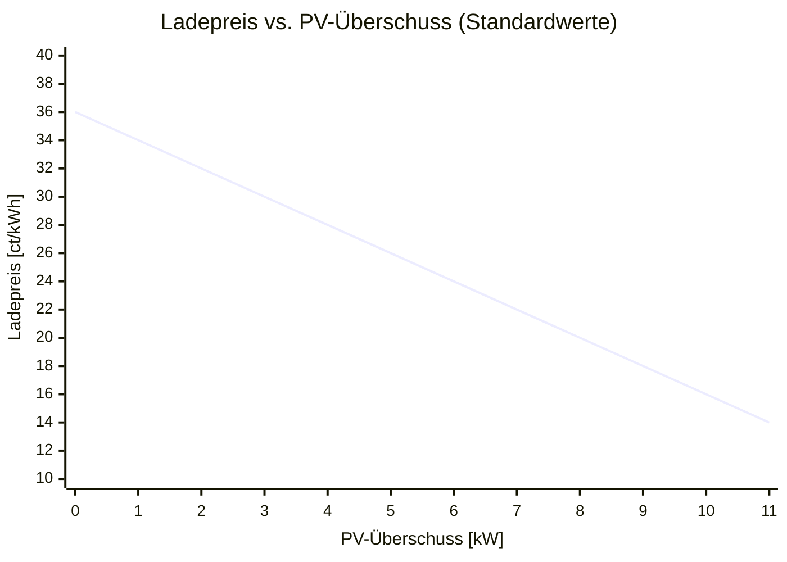
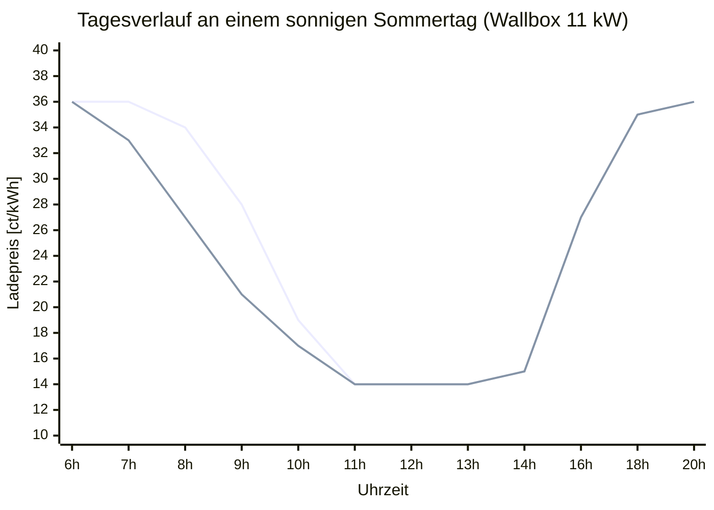
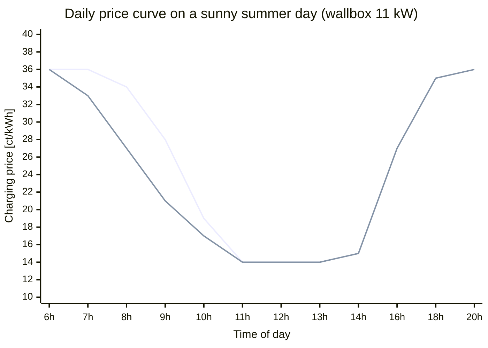

# Nachbarschaft-Laden

[🇩🇪 Deutsch](#nachbarschaft-laden) · [🇬🇧 English](#nachbarschaft-laden-english)

> **Frühes Entwicklungsstadium** — Dieses Projekt steckt noch in den Kinderschuhen. Der Ersteller ist kein professioneller Entwickler; der Code ist gewachsen, nicht geplant. Fehler sind wahrscheinlich, Verbesserungen willkommen.
> Wer das Projekt übernehmen, forken oder als Basis für eigene Ideen nutzen möchte – nur zu. Ein Stern oder ein kurzes Hallo freut mich trotzdem. 🙂
>
> **Early stage** — This project is in its very early days. The creator is not a professional developer; the code grew organically rather than being planned. Bugs are likely, improvements are welcome.
> Feel free to fork it, take it over, or use it as a starting point for your own ideas. A star or a quick hello is always appreciated. 🙂

Home Assistant Add-on für die Verwaltung einer nachbarschaftlichen EV-Ladestation. Es berechnet einen dynamischen Ladepreis aus dem aktuellen PV-Überschuss, zeichnet Ladesessions auf und zeigt alles auf einer Webseite und einem E-Paper-Display an.

**[→ Live-Demo mit Beispieldaten ansehen](https://bernd780.github.io/Nachbarschaft-Laden/)**

---

## Für wen ist das?

Du hast eine PV-Anlage, eine Wallbox – und Nachbarn, die gerne günstiger laden würden?

**Nachbarschaft-Laden** macht genau das möglich: Der Ladepreis sinkt automatisch, wenn gerade viel Sonne scheint. Per RFID-Karte wird jeder Ladevorgang einem Nutzer zugeordnet und abgerechnet. Kein Cloud-Dienst, keine Abonnements – alles läuft lokal in Home Assistant.

<p align="center">
  
</p>

---

## Screenshots

### Web-Dashboard

Der aktuelle Ladepreis, der Tagesverlauf und die PV-Prognose für die nächsten drei Tage – alles auf einen Blick im Browser, ohne App.

<p align="center">
  
</p>

- **Grün** = günstiger Preis (viel PV-Überschuss)
- **Gelb** = mittlerer Preis
- **Rot** = teurer Preis (Netzbezug)
- Die **beste Ladezeit** des Tages wird automatisch berechnet und hervorgehoben

### E-Paper-Display

Ein Waveshare 7,5"-Display am Eingang zeigt immer den aktuellen Ladepreis, die PV-Prognose als Smiley-Skala und den laufenden Ladevorgang an – auch ohne Smartphone oder Browser.

<p align="center">
  
</p>

<p align="center">
  
</p>

Das Display zeigt auf einen Blick alles, was Nachbarn am Ladepunkt wissen müssen:

**Oben:** Der aktuelle Ladepreis in ct/kWh – groß und gut lesbar, auch aus etwas Entfernung.

**Mitte:** Die PV-Überschuss-Prognose als Smiley-Skala für die nächsten drei Tage, jeweils mit dem erwarteten Ertrag in kWh:
- **😄 Sehr glücklich** = voller PV-Überschuss, günstigster Preis
- **🙂 Glücklich** = guter Überschuss
- **😐 Neutral** = gemischte Bedingungen
- **😞 Traurig** = wenig PV, hoher Netzanteil

**Unten:** Uhrzeit und Datum, ein QR-Code direkt zur Weboberfläche mit dem Preisverlauf und dem Ladeprotokoll sowie das Projektlogo.

Das Display aktualisiert sich alle 60 Sekunden automatisch (alle 5 Sekunden partiell). Es läuft auf einem ESP32 via ESPHome, zieht das Bild direkt von Home Assistant und benötigt keinen eigenen Server.

---

## Funktionen

- **Dynamischer Ladepreis** – berechnet in Echtzeit aus Netzleistung, Wallbox-Leistung und Batterieentladung
- **Preisverlauf** – 72-Stunden-Aufzeichnung, geglättet in 15-Minuten-Buckets
- **PV-Prognose** – 3-Tages-Vorschau als Smiley-Skala (traurig bis sehr glücklich)
- **Session-Tracking** – Energie, Kosten, Dauer und Nutzer (per RFID) je Ladevorgang
- **Saldo-Verwaltung** – offene Beträge je Nutzer, Zahlung über HA-Helfer buchbar
- **Weboberfläche** – `index.html` (Preis-Dashboard) und `sessions.html` (Ladeverlauf)
- **E-Paper-Display** – 460×160 Smiley-Bild für Waveshare 7,5" via ESPHome

---

## Installation

### Voraussetzungen

- Home Assistant OS oder Supervised
- go-eCharger mit HA-Integration
- PV-Anlage mit Echtzeit-Leistungssensor

### Add-on installieren

1. Den Ordner `addon/` auf den HA-Host kopieren, z. B. nach `/addons/nachbarschaft-laden/`
2. In HA: **Einstellungen → Add-ons → Add-on-Store → ⋮ → Lokale Add-ons neu laden**
3. „Nachbarschaft-Laden" unter „Lokale Add-ons" → **Installieren → Starten**

### Hilfsfelder

Es sind **keine HA-Helfer nötig**. Das Add-on verwaltet alle Zwischenwerte intern:

- Session-Startwerte (Zählerstand, Kosten-Integral) werden in `session_active.json` gespeichert
- Hausverbrauch und Ladeziels-SOC sind feste Werte in der Add-on-Konfiguration

---

## Konfiguration

Nach der Installation: **Add-on → Konfiguration**. Alle Felder haben sinnvolle Voreinstellungen.

### Ladepreis-Berechnung

Das Add-on berechnet den Preis direkt aus drei Leistungssensoren. Kein externer Preissensor nötig.

#### Eingangssensoren

| Option | Bedeutung | Voreinstellung |
|---|---|---|
| `sensor_netzleistung` | Netzleistung am Hauptzähler in W (positiv = Bezug, negativ = Einspeisung) | `sensor.leistung_stromzaehler` |
| `sensor_wallbox_leistung` | Aktuelle Ladeleistung der Wallbox in W | `sensor.go_echarger_XXXXXX_nrg_12` |
| `sensor_batterie_leistung` | Aktuelle Batterieentladungsleistung in W (positiv = Entladung) | `sensor.summe_battery_leistung` |

#### Preiskonstanten

| Option | Bedeutung | Voreinstellung |
|---|---|---|
| `preis_einspeiseverguetung_ct` | Einspeisevergütung in ct/kWh – Untergrenze des Preiskorridors | `8.0` |
| `preis_marge_ct` | Aufschlag in ct/kWh (gilt für Unter- und Obergrenze) | `6.0` |
| `preis_netzbezug_ct` | Netzbezugspreis in ct/kWh – Obergrenze des Preiskorridors | `30.0` |
| `preis_zielleistung_kw` | PV-Überschuss in kW, ab dem der günstigste Preis gilt | `11.0` |

Mit den Voreinstellungen liegt der Ladepreis zwischen **14 ct/kWh** (voller PV-Überschuss) und **36 ct/kWh** (Netzbezug).

### PV-Prognose

| Option | Bedeutung | Voreinstellung |
|---|---|---|
| `sensor_pv_morgen` | Erwarteter PV-Ertrag morgen in kWh | `sensor.morgenpv` |
| `sensor_pv_uebermorgen` | Erwarteter PV-Ertrag übermorgen in kWh | `sensor.uebermorgenpv` |
| `sensor_pv_in3tagen` | Erwarteter PV-Ertrag in 3 Tagen in kWh | `sensor.pvin3tagen` |
| `sensor_pv_erzeugung_heute` | Heutige PV-Erzeugung in % des Tagesziels | `sensor.prozentpverzeugungheute` |

### Fahrzeug & Ladestation

| Option | Bedeutung | Voreinstellung |
|---|---|---|
| `sensor_fahrzeug_akku` | Aktueller Ladestand des Fahrzeugs in % | `sensor.mein_fahrzeug_battery` |
| `sensor_ladegeraet_status` | Fahrzeugstatus am Ladegerät (`Charging`, `Complete`, …) | `sensor.go_echarger_XXXXXX_car` |
| `sensor_zaehlerstand_kwh` | Gesamtzähler der Wallbox in kWh (steigt monoton) | `sensor.go_echarger_XXXXXX_eto` |
| `sensor_kosten_integral` | Riemann-Integral der Ladekosten in € (steigt monoton) | `sensor.go_echarger_kosten_integral_2` |
| `sensor_rfid_karte` | Zuletzt erkannte RFID-Karte | `select.go_echarger_XXXXXX_trx` |

### evcc-Sensoren (optional)

Nur nötig, wenn evcc installiert ist. Leer lassen, wenn nicht vorhanden.

| Option | Bedeutung |
|---|---|
| `sensor_session_energie` | Energie der laufenden Session in kWh |
| `sensor_session_dauer` | Dauer der laufenden Session in Sekunden |
| `sensor_session_soc` | Fahrzeug-SOC laut evcc in % |

### Standardwerte & optionale HA-Entities

| Option | Bedeutung | Voreinstellung |
|---|---|---|
| `hausverbrauch_kwh` | Täglicher Hausverbrauch in kWh (für PV-Überschuss-Berechnung) | `10.0` |
| `ladeziel_soc` | Gewünschter Ziel-SOC des Fahrzeugs in % | `80` |
| `helper_hausverbrauch` | Optional: HA-Entity-ID, die den Standardwert überschreibt | `""` |
| `helper_ladeziel_soc` | Optional: HA-Entity-ID, die den Standardwert überschreibt | `""` |

### Ausgabe & Darstellung

| Option | Bedeutung | Voreinstellung |
|---|---|---|
| `qr_code_url` | URL als QR-Code auf dem E-Paper-Display | `https://nachbarschaft-laden.de/local/nachbarschaft-laden/index.html` |
| `web_unterverzeichnis` | Unterordner unter `/config/www/` für alle erzeugten Dateien | `nachbarschaft-laden` |

### RFID-Benutzer

Für jede Ladekarte einen Eintrag anlegen:

```yaml
rfid_benutzer:
  - rfid: "04AB12CD34EF56"
    name: "Max Mustermann"
    payment_helper: "input_number.nl_bezahlt_max_mustermann"
```

Das Add-on legt den unter `payment_helper` angegebenen `input_number`-Helper **automatisch** in HA an, falls er noch nicht existiert. Sobald dort ein Betrag eingetragen wird, wird er vom offenen Saldo abgezogen und der Helper auf 0 zurückgesetzt.

Die RFID-ID lässt sich ermitteln, indem die Karte ans Ladegerät gehalten und dann der Zustand von `sensor_rfid_karte` in HA abgelesen wird.

---

## Preisbildung

### Begriffe & Energieflüsse

| Begriff | Bedeutung |
|---|---|
| **PV-Produktion** | Momentane Leistung der Solaranlage in Watt |
| **Eigenbedarf** | Strom, den das Haus selbst verbraucht (Licht, Heizung, Geräte – ohne Wallbox) |
| **Netzbezug** | Wenn PV-Produktion < Gesamtverbrauch → Differenz kommt aus dem Netz (positiver Zählerwert) |
| **Netzeinspeisung** | Wenn PV-Produktion > Gesamtverbrauch → Überschuss fließt ins Netz (negativer Zählerwert, ~8 ct/kWh Vergütung) |
| **Batterieentladung** | Gespeicherte Energie fließt zurück in Haus und Wallbox |
| **PV-Überschuss** | Anteil der Wallbox-Leistung, der tatsächlich aus der Sonne kommt |

Vereinfachtes Bild der Energieflüsse:

```
            ┌──────────────┐
            │  ☀️ PV-Anlage │
            └──────┬───────┘
                   │ Produktion
       ┌───────────┼───────────┐
       ▼           ▼           ▼
  🏠 Eigenbedarf  🔋 Batterie  ⚡ Wallbox   🔌 Netz
       ▲                ▲           │
       └────────────────┘           │ Netzbezug (teuer) /
        Batterieentladung           │ Netzeinspeisung (vergütet)
```

### Berechnung des PV-Überschusses

Das System hat keinen direkten PV-Produktionssensor. Es errechnet den solaren Anteil der Wallbox-Leistung aus drei messbaren Größen:

```
PV-Überschuss [W] = Wallbox-Leistung − Netzleistung − Batterieentladung
```

Wenn das Netz gerade *einspeist* (negativer Zählerwert), subtrahiert die Formel einen negativen Wert – das erhöht den Überschuss, was korrekt ist: mehr PV als verbraucht.

**Beispiele** – Wallbox lädt mit 11 kW:

| Wetterlage | Netz | Batterie | PV-Überschuss | Ladepreis |
|---|---|---|---|---|
| Hochsommer, Mittagssonne | −2 kW (Einspeisung) | 0 kW | 13 kW → gekappt auf 11 kW | **14 ct/kWh** |
| Leicht bewölkt | +2 kW (Bezug) | 0 kW | 9 kW | ~18 ct/kWh |
| Bewölkt, Batterie hilft | +6 kW (Bezug) | 2 kW | 3 kW | ~30 ct/kWh |
| Nacht / kein PV | +11 kW (Bezug) | 0 kW | 0 kW | **36 ct/kWh** |

### Preisformel

```
Überschussgrad = min(PV-Überschuss / Zielleistung, 1.0)    ← 0,0 … 1,0

Preis [ct/kWh] = (Netzbezugspreis + Marge) − Überschussgrad × Preiskorridor
Preiskorridor  = Netzbezugspreis − Einspeisevergütung
```

Mit den Standardwerten (Einspeisevergütung 8 ct, Marge 6 ct, Netzbezugspreis 30 ct, Zielleistung 11 kW):

| PV-Überschuss | Überschussgrad | Ladepreis |
|---|---|---|
| 0 kW | 0 % | **36 ct/kWh** |
| 2,75 kW | 25 % | 30,5 ct/kWh |
| 5,5 kW | 50 % | **25 ct/kWh** |
| 8,25 kW | 75 % | 19,5 ct/kWh |
| ≥ 11 kW | 100 % | **14 ct/kWh** |

### Preiskurve



### Typischer Tagesverlauf

An einem sonnigen Sommertag sinkt der Preis mit der aufgehenden Sonne – aber **nicht sofort**: Solange die Hausbatterie noch lädt, fließt ein Großteil des PV-Stroms dorthin und steht der Wallbox nicht als Überschuss zur Verfügung.



**Obere Linie** – Tatsächlicher Preis: Hausbatterie lädt von ca. 7–10 Uhr (bis zu 3,5 kW), das reduziert den PV-Überschuss für die Wallbox erheblich.  
**Untere Linie** – Hypothetischer Preis ohne Akkuladung (Batterie bereits voll).

Die Akkuladephase verschiebt das günstige Ladefenster um 1–2 Stunden nach hinten. Ab ~11 Uhr, wenn die Batterie voll ist, kommt die volle PV-Leistung der Wallbox zugute.

> Das günstigste Ladefenster liegt typischerweise zwischen 11 und 15 Uhr. Die Web-Oberfläche berechnet und zeigt die beste Stunde des Tages automatisch an.

### Warum diese Preislogik?

| Grenze | Rechnung | Begründung |
|---|---|---|
| **Untergrenze 14 ct/kWh** | Einspeisevergütung (8 ct) + Marge (6 ct) | Jede kWh hätte für ~8 ct ins Netz eingespeist werden können. Die Marge deckt anteilige Betriebskosten. |
| **Obergrenze 36 ct/kWh** | Netzbezugspreis (30 ct) + Marge (6 ct) | Lädt der Nachbar aus dem Netz, trägt er den tatsächlichen Strompreis plus eine kleine Marge. |
| **Dazwischen** | Lineare Interpolation | Je mehr Sonne, desto günstiger – kontinuierlich und fair. |

Der Preis wird alle 5 Minuten neu berechnet und im Preisverlauf gespeichert.

---

## Erzeugte Dateien

Alle Dateien landen unter `/config/www/<web_unterverzeichnis>/`:

| Datei | Inhalt |
|---|---|
| `data.json` | Aktueller Preis, Preisverlauf, PV-Prognose, Ladevorgang-Status |
| `sessions.json` | Alle Ladesessions (max. 500) |
| `balances.json` | Offene Salden je Benutzer |
| `price_history.json` | Roher Preisverlauf (72 h) |
| `display_preview.png` | 480×800px Vorschau des E-Paper-Displays |

Zusätzlich wird `/config/www/display_combined.png` (460×160px, 1-bit) für das E-Paper-Display geschrieben.

---

## E-Paper-Display (optional)

Das Display (Waveshare 7,5") läuft via ESPHome auf einem ESP32:

1. `epaper/display.yaml` anpassen: unter `http_request → url` die HA-URL eintragen
2. Flashen:
   ```bash
   esphome compile epaper/display.yaml
   esphome upload epaper/display.yaml
   ```

Das Display lädt alle 60 Sekunden das aktuelle Bild von HA.

---

## Nachbarschaft-Laden (English)

[🇩🇪 Deutsch](#nachbarschaft-laden) · [🇬🇧 English](#nachbarschaft-laden-english)

Home Assistant add-on for managing a shared neighborhood EV charging station. It calculates a dynamic charging price based on current PV surplus, records charging sessions, and displays everything on a web dashboard and an e-paper display.

**[→ Live demo with sample data](https://bernd780.github.io/Nachbarschaft-Laden/)**

---

### Who is this for?

You have a solar PV system, a wallbox — and neighbors who'd love to charge at a fair price?

**Nachbarschaft-Laden** makes exactly that possible: the charging price drops automatically when the sun is shining. Each charging session is attributed to a user via RFID card and tracked for billing. No cloud service, no subscriptions — everything runs locally in Home Assistant.

---

### Features

- **Dynamic charging price** — calculated in real time from grid power, wallbox power, and battery discharge
- **Price history** — 72-hour log, smoothed into 15-minute buckets
- **PV forecast** — 3-day preview as a smiley scale (sad to very happy)
- **Session tracking** — energy, cost, duration, and user (via RFID) per charging session
- **Balance management** — open amounts per user, payments bookable via HA helpers
- **Web interface** — `index.html` (price dashboard) and `sessions.html` (session history)
- **E-paper display** — 460×160 smiley image for Waveshare 7.5" via ESPHome

---

### Installation

#### Requirements

- Home Assistant OS or Supervised
- go-eCharger with HA integration
- PV system with real-time power sensor

#### Install the add-on

1. Copy the `addon/` folder to the HA host, e.g. to `/addons/nachbarschaft-laden/`
2. In HA: **Settings → Add-ons → Add-on Store → ⋮ → Reload local add-ons**
3. Find "Nachbarschaft-Laden" under "Local add-ons" → **Install → Start**

---

### Configuration

After installation: **Add-on → Configuration**. All fields have sensible defaults.

#### Charging price calculation

The add-on calculates the price directly from three power sensors. No external price sensor required.

**Input sensors**

| Option | Description | Default |
|---|---|---|
| `sensor_netzleistung` | Grid power at main meter in W (positive = consumption, negative = feed-in) | `sensor.leistung_stromzaehler` |
| `sensor_wallbox_leistung` | Current wallbox charging power in W | `sensor.go_echarger_XXXXXX_nrg_12` |
| `sensor_batterie_leistung` | Current battery discharge power in W (positive = discharging) | `sensor.summe_battery_leistung` |

**Price constants**

| Option | Description | Default |
|---|---|---|
| `preis_einspeiseverguetung_ct` | Feed-in tariff in ct/kWh — lower bound of the price corridor | `8.0` |
| `preis_marge_ct` | Markup in ct/kWh (applied to both bounds) | `6.0` |
| `preis_netzbezug_ct` | Grid purchase price in ct/kWh — upper bound of the price corridor | `30.0` |
| `preis_zielleistung_kw` | PV surplus in kW at which the lowest price applies | `11.0` |

With the default settings, the charging price ranges between **14 ct/kWh** (full PV surplus) and **36 ct/kWh** (grid only).

#### PV forecast

| Option | Description | Default |
|---|---|---|
| `sensor_pv_morgen` | Expected PV yield tomorrow in kWh | `sensor.morgenpv` |
| `sensor_pv_uebermorgen` | Expected PV yield the day after tomorrow in kWh | `sensor.uebermorgenpv` |
| `sensor_pv_in3tagen` | Expected PV yield in 3 days in kWh | `sensor.pvin3tagen` |
| `sensor_pv_erzeugung_heute` | Today's PV generation as % of daily target | `sensor.prozentpverzeugungheute` |

#### Vehicle & charging station

| Option | Description | Default |
|---|---|---|
| `sensor_fahrzeug_akku` | Current vehicle battery level in % | `sensor.mein_fahrzeug_battery` |
| `sensor_ladegeraet_status` | Vehicle status at charger (`Charging`, `Complete`, …) | `sensor.go_echarger_XXXXXX_car` |
| `sensor_zaehlerstand_kwh` | Wallbox total energy counter in kWh (monotonically increasing) | `sensor.go_echarger_XXXXXX_eto` |
| `sensor_kosten_integral` | Riemann integral of charging costs in € (monotonically increasing) | `sensor.go_echarger_kosten_integral_2` |
| `sensor_rfid_karte` | Last detected RFID card | `select.go_echarger_XXXXXX_trx` |

#### RFID users

Add one entry per RFID card:

```yaml
rfid_benutzer:
  - rfid: "04AB12CD34EF56"
    name: "Jane Smith"
    payment_helper: "input_number.nl_paid_jane_smith"
```

The add-on automatically creates the `input_number` helper specified under `payment_helper` in HA if it does not yet exist. When an amount is entered there, it is deducted from the open balance and the helper is reset to 0.

To find the RFID ID, hold the card against the charger and then read the state of `sensor_rfid_karte` in HA.

---

### Price calculation

#### Terms & energy flows

| Term | Meaning |
|---|---|
| **PV production** | Current output of the solar panels in watts |
| **Self-consumption** | Power used by the house itself (lights, appliances, heating — excluding the wallbox) |
| **Grid import** | When PV production < total consumption → difference drawn from the grid (positive meter reading) |
| **Grid feed-in** | When PV production > total consumption → surplus flows to the grid (negative meter reading, ~8 ct/kWh tariff) |
| **Battery discharge** | Stored energy flows back into the house and wallbox |
| **PV surplus** | The share of wallbox charging power that actually comes from solar energy |

Simplified energy flow:

```
            ┌──────────────┐
            │  ☀️ PV system  │
            └──────┬───────┘
                   │ production
       ┌───────────┼───────────┐
       ▼           ▼           ▼
  🏠 House load  🔋 Battery  ⚡ Wallbox   🔌 Grid
       ▲                ▲           │
       └────────────────┘           │ grid import (expensive) /
        battery discharge           │ grid feed-in (tariff)
```

#### How is the PV surplus measured?

The system has no direct PV production sensor. It derives the solar share of the wallbox charging from three measurable values:

```
PV surplus [W] = wallbox power − grid power − battery discharge
```

When the grid is currently *exporting* (negative meter reading), subtracting a negative value increases the surplus — correctly reflecting that more PV is available than needed.

**Examples** — wallbox charging at 11 kW:

| Conditions | Grid | Battery | PV surplus | Price |
|---|---|---|---|---|
| Peak summer sunshine | −2 kW (export) | 0 kW | 13 kW → capped at 11 kW | **14 ct/kWh** |
| Partly cloudy | +2 kW (import) | 0 kW | 9 kW | ~18 ct/kWh |
| Overcast, battery helping | +6 kW (import) | 2 kW | 3 kW | ~30 ct/kWh |
| Night / no PV | +11 kW (import) | 0 kW | 0 kW | **36 ct/kWh** |

#### Price formula

```
Surplus ratio = min(PV surplus / target power, 1.0)    ← 0.0 … 1.0

Price [ct/kWh] = (grid price + margin) − surplus ratio × price corridor
Price corridor = grid price − feed-in tariff
```

With default values (feed-in 8 ct, margin 6 ct, grid price 30 ct, target 11 kW):

| PV surplus | Surplus ratio | Charging price |
|---|---|---|
| 0 kW | 0 % | **36 ct/kWh** |
| 2.75 kW | 25 % | 30.5 ct/kWh |
| 5.5 kW | 50 % | **25 ct/kWh** |
| 8.25 kW | 75 % | 19.5 ct/kWh |
| ≥ 11 kW | 100 % | **14 ct/kWh** |

#### Price curve


#### Typical daily price curve

On a sunny summer day the price drops as the sun rises — but **not immediately**: as long as the home battery is still charging, a large portion of PV energy flows there and is not available to the wallbox as surplus.



**Upper line** – Actual price: home battery charging from approx. 7–10 am (up to 3.5 kW), which significantly reduces the PV surplus available to the wallbox.  
**Lower line** – Hypothetical price without battery charging (battery already full).

The battery charging phase shifts the cheap charging window by roughly 1–2 hours. From ~11 am onwards, once the battery is full, the full PV output benefits the wallbox.

> The cheapest charging window is typically between 11 am and 3 pm. The web interface automatically calculates and highlights the best hour of the day.

#### Why this pricing logic?

| Bound | Calculation | Rationale |
|---|---|---|
| **Lower bound 14 ct/kWh** | Feed-in tariff (8 ct) + margin (6 ct) | Every kWh could have been sold to the grid for ~8 ct. The margin covers operating costs. |
| **Upper bound 36 ct/kWh** | Grid price (30 ct) + margin (6 ct) | When charging from the grid, the neighbor pays the actual electricity cost plus a small margin. |
| **In between** | Linear interpolation | More sun → cheaper price — continuous and fair. |

The price is recalculated every 5 minutes and recorded in the price history.

---

### Generated files

All files are written to `/config/www/<web_unterverzeichnis>/`:

| File | Content |
|---|---|
| `data.json` | Current price, price history, PV forecast, session status |
| `sessions.json` | All charging sessions (max. 500) |
| `balances.json` | Open balances per user |
| `price_history.json` | Raw price history (72 h) |
| `display_preview.png` | 480×800px preview of the e-paper display |

Additionally, `/config/www/display_combined.png` (460×160px, 1-bit) is written for the e-paper display.

---

### E-paper display (optional)

The display (Waveshare 7.5") runs via ESPHome on an ESP32:

1. Edit `epaper/display.yaml`: enter the HA URL under `http_request → url`
2. Flash:
   ```bash
   esphome compile epaper/display.yaml
   esphome upload epaper/display.yaml
   ```

The display fetches the current image from HA every 60 seconds.
