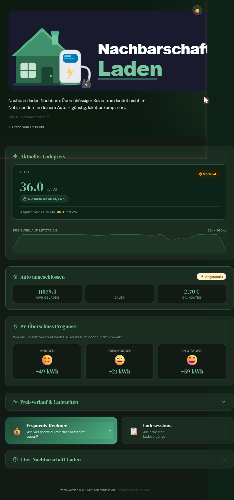
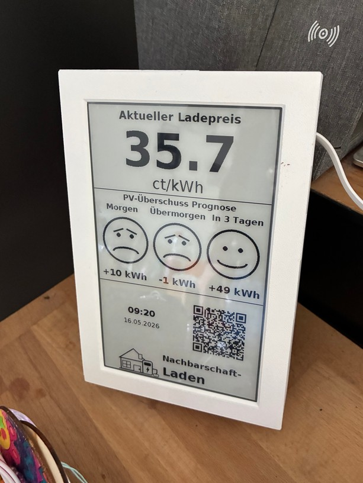
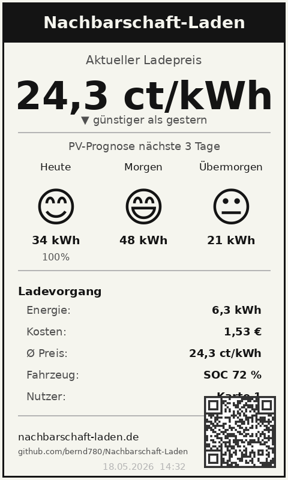
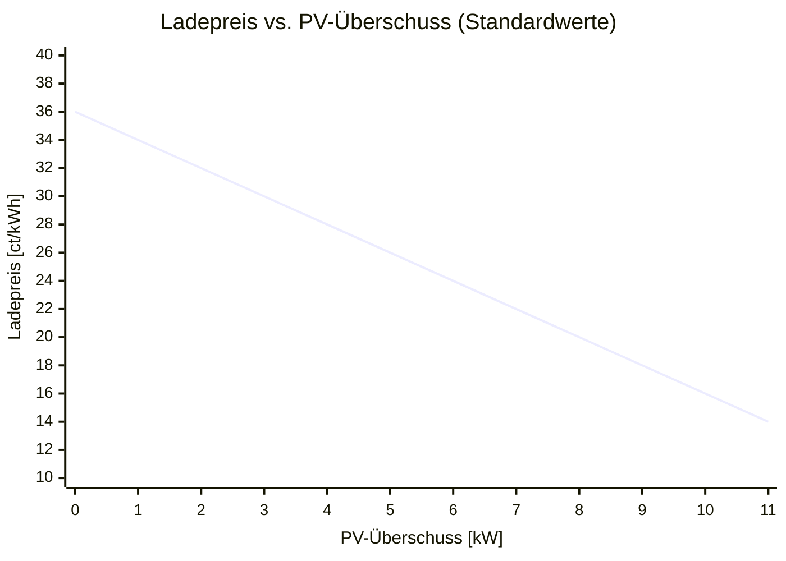
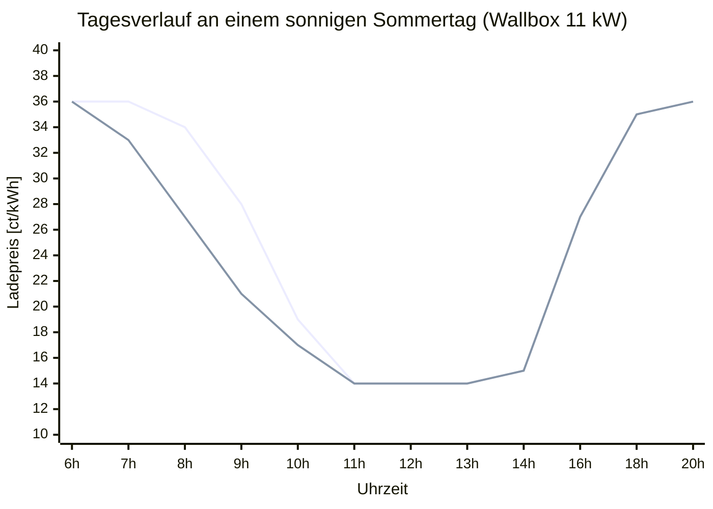
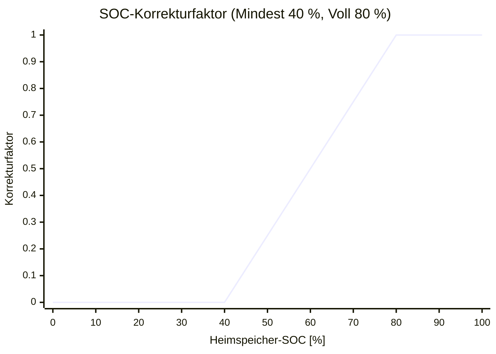

# Nachbarschaft-Laden

[](https://github.com/hacs/integration)
[](https://github.com/bernd780/Nachbarschaft-Laden/releases)
[](LICENSE)

[🇩🇪 Deutsch](#nachbarschaft-laden) · [🇬🇧 English](#nachbarschaft-laden-english)

> **Frühes Entwicklungsstadium** — Dieses Projekt steckt noch in den Kinderschuhen. Der Ersteller ist kein professioneller Entwickler; der Code ist gewachsen, nicht geplant. Fehler sind wahrscheinlich, Verbesserungen willkommen.
> Wer das Projekt übernehmen, forken oder als Basis für eigene Ideen nutzen möchte – nur zu. Ein Stern oder ein kurzes Hallo freut mich trotzdem. 🙂
>
> **Early stage** — This project is in its very early days. The creator is not a professional developer; the code grew organically rather than being planned. Bugs are likely, improvements are welcome.
> Feel free to fork it, take it over, or use it as a starting point for your own ideas. A star or a quick hello is always appreciated. 🙂

Home Assistant Add-on für die Verwaltung einer nachbarschaftlichen EV-Ladestation. Es berechnet einen dynamischen Ladepreis aus dem aktuellen PV-Überschuss, zeichnet Ladesessions auf und zeigt alles auf einer Webseite und einem E-Paper-Display an.

**[→ Live-Demo mit Beispieldaten ansehen](https://bernd780.github.io/Nachbarschaft-Laden/)**

---

## Installation

[](https://my.home-assistant.io/redirect/supervisor_add_addon_repository/?repository_url=https%3A%2F%2Fgithub.com%2Fbernd780%2FNachbarschaft-Laden)

Oder manuell: **Einstellungen → Add-ons → Add-on Store → ⋮ → Repositories** → URL eintragen:
```
https://github.com/bernd780/Nachbarschaft-Laden
```

Danach: „Nachbarschaft-Laden" im Add-on Store suchen → **Installieren → Starten**.

---

## Für wen ist das?

Du hast eine PV-Anlage, eine Wallbox – und Nachbarn, die gerne günstiger laden würden?

**Nachbarschaft-Laden** macht genau das möglich: Der Ladepreis sinkt automatisch, wenn gerade viel Sonne scheint. Per RFID-Karte wird jeder Ladevorgang einem Nutzer zugeordnet und abgerechnet. Kein Cloud-Dienst, keine Abonnements – alles läuft lokal in Home Assistant.

### Wie viel PV-Anlage braucht man dafür?

Weniger als man denkt – auch kleinere Anlagen liefern an einem sonnigen Sommertag überraschend viel Überschuss.

Die folgende Übersicht zeigt, was eine typische private Dachanlage an einem **klaren Sommertag in Deutschland** (Süddeutschland, Südausrichtung) realistisch ins System einspeist – nach Abzug von Hausverbrauch (~1,5 kW) und Heimspeicher-Ladung (~3 kW):

| Anlage | Peak-Leistung | Überschuss mittags | Max. Preisrabatt¹ | Günstige Ladestunden/Tag² |
|--------|:-------------:|:-----------------:|:-----------------:|:-------------------------:|
| 5 kWp  | ~4,5 kW       | ~2 kW             | ~18 %             | 2–3 h                     |
| 8 kWp  | ~7,5 kW       | ~5 kW             | ~45 %             | 4–5 h                     |
| 10 kWp | ~9 kW         | ~6,5 kW           | ~60 %             | 5–6 h                     |
| 15 kWp | ~13,5 kW      | ~11 kW            | **100 %** 🎉      | 6–8 h                     |
| 20 kWp | ~18 kW        | ~15 kW            | **100 %** 🎉      | 8–10 h                    |
| 25 kWp | ~22,5 kW      | ~19 kW            | **100 %** 🎉      | 9–11 h                    |

> ¹ Maximaler Rabatt auf den Netzstrompreis (Zielleistung 11 kW konfigurierbar)  
> ² Stunden mit spürbarem Preisnachlass gegenüber Netzbezug

```
Günstige Ladestunden an einem Sommertag

25 kWp  ░░░░░░░░░█████████████████████████████░░░░░░░
20 kWp  ░░░░░░░░░██████████████████████████░░░░░░░░░░
15 kWp  ░░░░░░░░░░████████████████████████░░░░░░░░░░░
10 kWp  ░░░░░░░░░░░░███████████████████░░░░░░░░░░░░░░
 8 kWp  ░░░░░░░░░░░░░██████████████░░░░░░░░░░░░░░░░░░
 5 kWp  ░░░░░░░░░░░░░░█████████░░░░░░░░░░░░░░░░░░░░░░
         6h  7h  8h  9h  10h 11h 12h 13h 14h 15h 16h 17h 18h 19h 20h
```

**Was bedeutet das in der Praxis?**

- **5–8 kWp** – Zur Mittagszeit (11–15 Uhr) entsteht echter Überschuss, sobald der Heimspeicher geladen ist. Nachbarn können in diesem Fenster mit bis zu 45 % Rabatt laden. Ideal für kurze Ladevorgänge oder Topper.

- **10–14 kWp** – Das Rabattfenster öffnet sich früher und schließt sich später. Gut die Hälfte des Tages liegt der Preis deutlich unter Netzbezugspreis. Eine vollständige Ladung (z. B. ~50 kWh) ist an einem Sommertag oft komplett aus PV-Überschuss möglich.

- **Ab 15 kWp** – Der Minimalpreis (Einspeisevergütung + Marge) wird mehrere Stunden am Stück erreicht. Selbst ein zweites Fahrzeug lässt sich gleichzeitig nahezu zum Selbstkostenpreis laden. Für dieses Modell besonders attraktiv: der Überschuss ist so groß, dass mehrere Nachbarn davon profitieren.

- **20–25 kWp** – An einem sonnigen Sommertag übersteigt der Überschuss (~100–115 kWh) den Tagesbedarf mehrerer Fahrzeuge deutlich. Der Ladepreis liegt für fast den gesamten Sonnentag beim Minimum.

> **Fazit:** Schon eine 8-kWp-Anlage macht dieses Modell sinnvoll – das günstigste Ladefenster ist für Nachbarn klar kommunizierbar, und der Nutzen für alle Seiten ist spürbar. Mit wachsender Anlagengröße wird das Angebot attraktiver, länger und entspannter zu betreiben.

---

## Screenshots

### Web-Dashboard

Der aktuelle Ladepreis, der Tagesverlauf und die PV-Prognose für die nächsten drei Tage – alles auf einen Blick im Browser, ohne App.

<p align="center">
  
</p>

- **Grün** = günstiger Preis (viel PV-Überschuss)
- **Gelb** = mittlerer Preis
- **Rot** = teurer Preis (Netzbezug)
- Die **beste Ladezeit** des Tages wird automatisch berechnet und hervorgehoben
- Vor der Kernzeit wird die **voraussichtlich günstigste Stunde** auf Basis der PV-Prognose angezeigt

### E-Paper-Display

Ein Waveshare 7,5"-Display am Eingang zeigt immer den aktuellen Ladepreis, die PV-Prognose als Smiley-Skala und Uhrzeit/Datum an – auch ohne Smartphone oder Browser.

<p align="center">
  
</p>

<p align="center">
  
</p>

Das Display zeigt auf einen Blick alles, was Nachbarn am Ladepunkt wissen müssen:

**Oben:** Der aktuelle Ladepreis in ct/kWh – groß und gut lesbar, auch aus etwas Entfernung.

**Mitte:** Die PV-Überschuss-Prognose als Smiley-Skala für die nächsten drei Tage (morgen, übermorgen, in 3 Tagen), jeweils mit dem erwarteten Netto-Überschuss in kWh:
- **😄 Sehr glücklich** = voller PV-Überschuss, günstigster Preis
- **🙂 Glücklich** = guter Überschuss
- **😐 Neutral** = gemischte Bedingungen
- **😞 Traurig** = wenig PV, hoher Netzanteil

**Unten:** Uhrzeit und Datum, ein QR-Code direkt zur Weboberfläche sowie das Projektlogo.

Das Display aktualisiert sich alle 5 Sekunden partiell und alle 10 Minuten vollständig (Full-Refresh). Nachts (22–6 Uhr) wird das Intervall automatisch auf 30 Minuten gedrosselt. Es läuft auf einem ESP32 via ESPHome, zieht das Bild direkt von Home Assistant und benötigt keinen eigenen Server.

---

## Funktionen

- **Dynamischer Ladepreis** – berechnet alle 5 Sekunden aus Netzleistung, Wallbox-Leistung und Batterieentladung
- **Preisverlauf** – 2-Wochen-Aufzeichnung, geglättet in 15-Minuten-Buckets, 72h-Ansicht im Dashboard
- **PV-Prognose** – 3-Tages-Vorschau als Smiley-Skala (traurig bis sehr glücklich)
- **Günstigste Ladezeit** – automatisch berechnet; vor der Kernzeit als Forecast aus PV-Peak-Prognose
- **Session-Tracking** – Energie, Kosten, Dauer und Nutzer (per RFID) je Ladevorgang
- **Saldo-Verwaltung** – offene Beträge je Nutzer, Zahlung über HA-Helfer buchbar
- **Weboberfläche** – `index.html` (Preis-Dashboard) und `sessions.html` (Ladeverlauf)
- **E-Paper-Display** – Waveshare 7,5" via ESPHome mit Echtzeit-Preis, Smiley-Prognose, QR-Code
- **Pause-Modus** – Display zeigt frei definierbaren Text (z. B. „Außer Betrieb") via HA-Helper
- **Offline-Alarm** – HA-Automation benachrichtigt bei Display-Ausfall (Push + persistente Benachrichtigung)
- **Sofort-Refresh-Button** – HA-Button löst sofortigen Full-Refresh des Displays aus

---

## Voraussetzungen

- Home Assistant OS oder Supervised
- go-eCharger mit HA-Integration
- PV-Anlage mit Echtzeit-Leistungssensor in HA

---

## Konfiguration

Nach der Installation: **Add-on → Konfiguration**. Alle Felder haben sinnvolle Voreinstellungen.

### Ladepreis-Berechnung

Das Add-on berechnet den Preis direkt aus drei Leistungssensoren. Kein externer Preissensor nötig.

#### Eingangssensoren

| Option | Bedeutung | Voreinstellung |
|---|---|---|
| `sensor_netzleistung` | Netzleistung am Hauptzähler in W (positiv = Bezug, negativ = Einspeisung) | `sensor.leistung_stromzaehler` |
| `sensor_wallbox_leistung` | Aktuelle Ladeleistung der Wallbox in W | `sensor.go_echarger_XXXXXX_nrg_12` |
| `sensor_batterie_leistung` | Batterieleistung in W (positiv = Entladung, negativ = Laden) | `sensor.summe_battery_leistung` |
| `sensor_batterie_soc` | Ladestand des Heimspeichers in % | `sensor.summe_batterysoc` |

#### Preiskonstanten

| Option | Bedeutung | Voreinstellung |
|---|---|---|
| `preis_einspeiseverguetung_ct` | Einspeisevergütung in ct/kWh – Untergrenze des Preiskorridors | `8.0` |
| `preis_marge_ct` | Aufschlag in ct/kWh (gilt für Unter- und Obergrenze) | `6.0` |
| `preis_netzbezug_ct` | Netzbezugspreis in ct/kWh – Obergrenze des Preiskorridors | `30.0` |
| `preis_zielleistung_kw` | PV-Überschuss in kW, ab dem der günstigste Preis gilt | `11.0` |

Mit den Voreinstellungen liegt der Ladepreis zwischen **14 ct/kWh** (voller PV-Überschuss) und **36 ct/kWh** (Netzbezug).

### Heimspeicher-SOC-Gewichtung

Wenn der Heimspeicher lädt, „sieht" die Wallbox weniger PV-Überschuss – der Ladepreis steigt. Das ist sinnvoll, solange der Akku noch leer ist. Ist er aber schon halb voll, lohnt es sich kaum noch, den Nachbarn dafür zahlen zu lassen. Diese Parameter steuern, ab wann der Einfluss des Akku-Bezugs auf den Ladepreis schrittweise zurückgeht:

| Option | Bedeutung | Voreinstellung |
|---|---|---|
| `akku_soc_mindest` | Unterhalb dieses SOC (%) wirkt der Akku-Bezug voll auf den Preis | `40` |
| `akku_soc_voll` | Ab diesem SOC (%) hat der Akku-Bezug keinen Einfluss mehr; leer lassen = deaktiviert | `80` |

Zwischen den beiden Schwellen wird der Einfluss **linear interpoliert**. Ist `akku_soc_voll` leer, ist das Feature deaktiviert (Akku-Bezug wirkt immer voll). → Detaillierte Erklärung: [Heimspeicher-Logik](#heimspeicher-soc-logik)

### PV-Prognose

| Option | Bedeutung | Voreinstellung |
|---|---|---|
| `sensor_pv_morgen` | Erwarteter PV-Ertrag morgen in kWh | `sensor.morgenpv` |
| `sensor_pv_uebermorgen` | Erwarteter PV-Ertrag übermorgen in kWh | `sensor.uebermorgenpv` |
| `sensor_pv_in3tagen` | Erwarteter PV-Ertrag in 3 Tagen in kWh | `sensor.pvin3tagen` |
| `sensor_pv_erzeugung_heute` | Heutige PV-Erzeugung in kWh | `sensor.daily_pv_generation` |
| `sensor_pv_rest_heute` | Noch zu erwartende PV-Erzeugung heute in kWh (optional) | `""` |
| `sensor_pv_peak_zeit_heute` | Zeitpunkt der heutigen PV-Spitzenleistung (Timestamp-Sensor) | `""` |

> **Hinweis:** `sensor_pv_peak_zeit_heute` wird für die „voraussichtlich günstigste Stunde"-Anzeige benötigt. Passender Sensor z. B. von der Solcast- oder Forecast.Solar-Integration.

### Kernzeit

| Option | Bedeutung | Voreinstellung |
|---|---|---|
| `kernzeit_start` | Beginn der Auswertungsperiode für günstigste Stunde (Stunde 0–23) | `11` |
| `kernzeit_ende` | Ende der Auswertungsperiode (exklusiv) | `16` |

### Fahrzeug & Ladestation

| Option | Bedeutung | Voreinstellung |
|---|---|---|
| `sensor_fahrzeug_akku` | Aktueller Ladestand des Fahrzeugs in % | `sensor.mein_fahrzeug_battery` |
| `sensor_ladegeraet_status` | Fahrzeugstatus am Ladegerät (`Charging`, `Complete`, …) | `sensor.go_echarger_XXXXXX_car` |
| `sensor_zaehlerstand_kwh` | Gesamtzähler der Wallbox in kWh (steigt monoton) | `sensor.go_echarger_XXXXXX_eto` |
| `sensor_kosten_integral` | Riemann-Integral der Ladekosten in € (steigt monoton) | `sensor.go_echarger_kosten_integral_2` |
| `sensor_rfid_karte` | Zuletzt erkannte RFID-Karte | `select.go_echarger_XXXXXX_trx` |

### evcc-Sensoren (optional)

Nur nötig, wenn evcc installiert ist. Leer lassen, wenn nicht vorhanden.

| Option | Bedeutung |
|---|---|
| `sensor_session_energie` | Energie der laufenden Session in kWh |
| `sensor_session_dauer` | Dauer der laufenden Session in Sekunden |
| `sensor_session_soc` | Fahrzeug-SOC laut evcc in % |

### Standardwerte & optionale HA-Entities

| Option | Bedeutung | Voreinstellung |
|---|---|---|
| `hausverbrauch_kwh` | Täglicher Hausverbrauch in kWh (für PV-Überschuss-Berechnung) | `10.0` |
| `ladeziel_soc` | Gewünschter Ziel-SOC des Fahrzeugs in % | `80` |
| `helper_hausverbrauch` | Optional: `input_number`-Entity-ID, die den Standardwert überschreibt | `""` |
| `helper_ladeziel_soc` | Optional: `input_number`-Entity-ID, die den Standardwert überschreibt | `""` |

### Ausgabe & Darstellung

| Option | Bedeutung | Voreinstellung |
|---|---|---|
| `qr_code_url` | URL als QR-Code auf dem E-Paper-Display | `https://…/index.html` |
| `web_unterverzeichnis` | Unterordner unter `/config/www/` für alle erzeugten Dateien | `nachbarschaft-laden` |

### RFID-Benutzer

Für jede Ladekarte einen Eintrag anlegen:

```yaml
rfid_benutzer:
  - rfid: "04AB12CD34EF56"
    name: "Max Mustermann"
    payment_helper: "input_number.nl_bezahlt_max_mustermann"
```

Das Add-on legt den unter `payment_helper` angegebenen `input_number`-Helper **automatisch** in HA an. Sobald dort ein Betrag eingetragen wird, wird er vom offenen Saldo abgezogen und der Helper auf 0 zurückgesetzt.

Die RFID-ID lässt sich ermitteln, indem die Karte ans Ladegerät gehalten und dann der Zustand von `sensor_rfid_karte` in HA abgelesen wird.

---

## Automatisch angelegte HA-Helfer

Das Add-on und die ESPHome-Konfiguration nutzen folgende HA-Helper, die beim ersten Start automatisch angelegt werden müssen (bzw. vom Nutzer anzulegen sind):

| Helper | Typ | Funktion |
|---|---|---|
| `input_number.nl_surplus_morgen` | input_number | PV-Netto-Überschuss morgen in kWh (von AppDaemon beschrieben) |
| `input_number.nl_surplus_uebermorgen` | input_number | PV-Netto-Überschuss übermorgen in kWh |
| `input_number.nl_surplus_in3tagen` | input_number | PV-Netto-Überschuss in 3 Tagen in kWh |
| `input_boolean.nl_display_pause` | input_boolean | Display-Pause aktivieren (zeigt Pause-Text statt Preis) |
| `input_text.nl_display_pause_text` | input_text | Text für den Pause-Screen (max. 60 Zeichen) |
| `input_number.nl_bezahlt_<name>` | input_number | Zahlungseingang je RFID-Nutzer (automatisch angelegt) |

> Die `nl_surplus_*`-Helper werden vom Add-on alle 5 Minuten aktualisiert und überleben HA-Neustarts. Das E-Paper liest diese direkt aus HA.

---

## Preisbildung

### Begriffe & Energieflüsse

| Begriff | Bedeutung |
|---|---|
| **PV-Produktion** | Momentane Leistung der Solaranlage in Watt |
| **Eigenbedarf** | Strom, den das Haus selbst verbraucht (Licht, Heizung, Geräte – ohne Wallbox) |
| **Netzbezug** | Wenn PV-Produktion < Gesamtverbrauch → Differenz kommt aus dem Netz (positiver Zählerwert) |
| **Netzeinspeisung** | Wenn PV-Produktion > Gesamtverbrauch → Überschuss fließt ins Netz (negativer Zählerwert, ~8 ct/kWh Vergütung) |
| **Batterieentladung** | Gespeicherte Energie fließt zurück in Haus und Wallbox |
| **PV-Überschuss** | Anteil der Wallbox-Leistung, der tatsächlich aus der Sonne kommt |

Vereinfachtes Bild der Energieflüsse:

```
            ┌──────────────┐
            │  ☀️ PV-Anlage │
            └──────┬───────┘
                   │ Produktion
       ┌───────────┼───────────┐
       ▼           ▼           ▼
  🏠 Eigenbedarf  🔋 Batterie  ⚡ Wallbox   🔌 Netz
       ▲                ▲           │
       └────────────────┘           │ Netzbezug (teuer) /
        Batterieentladung           │ Netzeinspeisung (vergütet)
```

### Berechnung des PV-Überschusses

Das System hat keinen direkten PV-Produktionssensor. Es errechnet den solaren Anteil der Wallbox-Leistung aus drei messbaren Größen:

```
PV-Überschuss [W] = Wallbox-Leistung − Netzleistung − Batterieentladung
```

Wenn das Netz gerade *einspeist* (negativer Zählerwert), subtrahiert die Formel einen negativen Wert – das erhöht den Überschuss, was korrekt ist: mehr PV als verbraucht.

**Beispiele** – Wallbox lädt mit 11 kW:

| Wetterlage | Netz | Batterie | PV-Überschuss | Ladepreis |
|---|---|---|---|---|
| Hochsommer, Mittagssonne | −2 kW (Einspeisung) | 0 kW | 13 kW → gekappt auf 11 kW | **14 ct/kWh** |
| Leicht bewölkt | +2 kW (Bezug) | 0 kW | 9 kW | ~18 ct/kWh |
| Bewölkt, Batterie hilft | +6 kW (Bezug) | 2 kW | 3 kW | ~30 ct/kWh |
| Nacht / kein PV | +11 kW (Bezug) | 0 kW | 0 kW | **36 ct/kWh** |

### Preisformel

```
Überschussgrad = min(PV-Überschuss / Zielleistung, 1.0)    ← 0,0 … 1,0

Preis [ct/kWh] = (Netzbezugspreis + Marge) − Überschussgrad × Preiskorridor
Preiskorridor  = Netzbezugspreis − Einspeisevergütung
```

Mit den Standardwerten (Einspeisevergütung 8 ct, Marge 6 ct, Netzbezugspreis 30 ct, Zielleistung 11 kW):

| PV-Überschuss | Überschussgrad | Ladepreis |
|---|---|---|
| 0 kW | 0 % | **36 ct/kWh** |
| 2,75 kW | 25 % | 30,5 ct/kWh |
| 5,5 kW | 50 % | **25 ct/kWh** |
| 8,25 kW | 75 % | 19,5 ct/kWh |
| ≥ 11 kW | 100 % | **14 ct/kWh** |

### Preiskurve



### Typischer Tagesverlauf

An einem sonnigen Sommertag sinkt der Preis mit der aufgehenden Sonne – aber **nicht sofort**: Solange die Hausbatterie noch lädt, fließt ein Großteil des PV-Stroms dorthin und steht der Wallbox nicht als Überschuss zur Verfügung.



**Obere Linie** – Tatsächlicher Preis: Hausbatterie lädt von ca. 7–10 Uhr (bis zu 3,5 kW), das reduziert den PV-Überschuss für die Wallbox erheblich.  
**Untere Linie** – Hypothetischer Preis ohne Akkuladung (Batterie bereits voll).

> Das günstigste Ladefenster liegt typischerweise zwischen 11 und 15 Uhr. Die Web-Oberfläche berechnet und zeigt die beste Stunde des Tages automatisch an.

### Heimspeicher-SOC-Logik

#### Das Problem ohne SOC-Gewichtung

Wenn der Heimspeicher lädt (z. B. mit 3 kW), floss dieser Strom aus der PV-Anlage. Für die Preisformel sieht das genauso aus wie Netzbezug – der scheinbare PV-Überschuss für die Wallbox sinkt, der Ladepreis steigt. Das ist fair, solange der Akku noch leer ist und wirklich „wertvolle" Energie aufnimmt. Aber wenn der Akku schon bei 90 % steht und die letzten kWh aufnimmt, ist es wenig sinnvoll, den Nachbarn dafür mit einem höheren Preis zu belasten.

#### Die Lösung: SOC-abhängige Korrektur

Je voller der Heimspeicher, desto mehr wird sein Strombezug bei der Überschussberechnung **ignoriert**. Die Korrektur läuft zwischen zwei konfigurierbaren Schwellen:

```
SOC ≤ akku_soc_mindest (z. B. 40 %)  →  Akku-Bezug wirkt voll    (Faktor 0)
SOC ≥ akku_soc_voll    (z. B. 80 %)  →  Akku-Bezug wird ignoriert (Faktor 1)
Dazwischen                            →  lineare Interpolation
```

Die korrigierte Formel lautet:

```
PV-Überschuss [W] = Wallbox − Netzleistung − Batterieentladung + (Faktor × Akku-Ladeleistung)
```

#### Beispiele – Wallbox lädt mit 11 kW, Akku lädt mit 3 kW

| Akku-SOC | Faktor | Zurückaddiert | PV-Überschuss | Ladepreis |
|:---:|:---:|:---:|:---:|:---:|
| 20 % | 0,0 | 0 kW | 5 kW | ~26 ct/kWh |
| 40 % | 0,0 | 0 kW | 5 kW | ~26 ct/kWh |
| 60 % | 0,5 | 1,5 kW | 6,5 kW | ~22 ct/kWh |
| 80 % | 1,0 | 3,0 kW | 8 kW | ~18 ct/kWh |
| 95 % | 1,0 | 3,0 kW | 8 kW | ~18 ct/kWh |

*(Annahme: Netzeinspeisung 3 kW, keine Batterieentladung)*



> **Deaktivieren:** `akku_soc_voll` leer lassen → der Faktor bleibt immer 0, Akku-Bezug wirkt stets voll auf den Preis (Verhalten wie vor Einführung dieser Funktion).

### Warum diese Preislogik?

| Grenze | Rechnung | Begründung |
|---|---|---|
| **Untergrenze 14 ct/kWh** | Einspeisevergütung (8 ct) + Marge (6 ct) | Jede kWh hätte für ~8 ct ins Netz eingespeist werden können. Die Marge deckt anteilige Betriebskosten. |
| **Obergrenze 36 ct/kWh** | Netzbezugspreis (30 ct) + Marge (6 ct) | Lädt der Nachbar aus dem Netz, trägt er den tatsächlichen Strompreis plus eine kleine Marge. |
| **Dazwischen** | Lineare Interpolation | Je mehr Sonne, desto günstiger – kontinuierlich und fair. |

---

## Erzeugte Dateien

Alle Dateien landen unter `/config/www/<web_unterverzeichnis>/`:

| Datei | Inhalt |
|---|---|
| `data.json` | Aktueller Preis, Preisverlauf (6h geglättet + 72h lang), PV-Prognose, Ladevorgang-Status, günstigste Stunden |
| `sessions.json` | Alle Ladesessions (max. 500, FIFO) |
| `balances.json` | Offene Salden je Benutzer |
| `price_history.json` | Roher Preisverlauf der letzten **2 Wochen** (336h) |
| `display_combined.png` | 460×136px, 1-bit Smiley-Bild für das E-Paper |
| `display_preview.png` | 480×800px RGB-Vorschau des vollständigen E-Paper-Layouts |
| `session_active.json` | Start-Snapshot der laufenden Session (Zählerstand, Kosten-Integral) |

Nicht-öffentliche Daten (nicht über den Webserver erreichbar) landen unter `/config/nachbarschaft-laden-data/`:

| Datei | Inhalt |
|---|---|
| `statistics.jsonl` | Long-Term-Statistik (1 Zeile pro Session + Preis-Tick alle 5 Min), 365 Tage – für Grafana & Co. |
| `health_history.json` | Diagnose-Snapshots mit Anomalie-Erkennung, 7 Tage |
| `backups/` | Automatische Daten-Backups (ZIP) |

---

## Backup & Restore

**Gesamtsicherung:** Alle Daten des Add-ons liegen unter `/config/` – sie sind damit automatisch in jedem **Home-Assistant-Backup** enthalten (Einstellungen → System → Backups). Auch die Add-on-Konfiguration wird dort mitgesichert. Empfehlung: automatische HA-Backups aktivieren.

**Gezielter Daten-Export:** Das Add-on erstellt täglich um 03:30 Uhr ein ZIP mit allen Datendateien (Sessions, Salden, Preishistorie, Statistik, Health-History) unter `/config/nachbarschaft-laden-data/backups/`. Die letzten 10 Backups werden aufbewahrt. Zusätzlich kann ein Backup manuell ausgelöst werden: einen **Button-Helfer** mit der Entity-ID `input_button.nl_backup_erstellen` anlegen (Einstellungen → Geräte & Dienste → Helfer) – jeder Druck erzeugt sofort ein Backup. Abholen per Samba, SSH oder Datei-Editor-Add-on – die Backups liegen bewusst **nicht** im öffentlichen `www/`-Verzeichnis.

**Restore:** Ein Backup-ZIP nach `/config/nachbarschaft-laden-data/restore/` kopieren und das Add-on neu starten. Vor dem Einspielen wird automatisch ein Sicherungs-Backup des aktuellen Stands erstellt; alle Dateien werden vor dem Überschreiben validiert. Nach Erfolg wird das ZIP in `*.zip.restored` umbenannt.

---

## Lücken-Übernahme (Admin)

Nicht erfasste Zähler-Lücken (siehe [Lücken-Erkennung](#automatisch-angelegte-ha-helfer)) lassen sich gesammelt und dauerhaft mit einem festen Preis abrechnen – **ausschließlich über Home Assistant**, nicht über die öffentliche Website (dort gibt es dafür bewusst kein Bedienelement).

Zwei Helfer anlegen (Einstellungen → Geräte & Dienste → Helfer):

| Helfer | Typ | Zweck |
|---|---|---|
| `input_number.nl_luecken_preis_ct` | Zahl | Preis in ct/kWh, der beim nächsten Knopfdruck für **alle** offenen Lücken verwendet wird |
| `input_button.nl_luecken_uebernehmen` | Taste | Löst die Übernahme aus |

Ablauf bei Knopfdruck: Preis aus dem Zahlenfeld lesen (Abbruch falls 0 oder leer) → Sicherungs-Backup erstellen → alle Lücken-Einträge in `sessions.json` permanent in reguläre Sessions umwandeln (Benutzer „Unbestimmt", Preis = gesetzter ct/kWh-Wert) → Betrag auf das Guthaben von „Unbestimmt" verbuchen → in `statistics.jsonl` nachtragen. Die Aktion ist **irreversibel** (aber durch das automatische Backup jederzeit rückgängig zu machen, siehe Restore oben).

---

## E-Paper-Display (optional)

Das Display (Waveshare 7,5" V2p) läuft via ESPHome auf einem ESP32.

### Konfiguration

Alle Zugangsdaten werden in `epaper/secrets.yaml` hinterlegt (nicht im Repo):

```yaml
wifi_ssid: "MeinWLAN"
wifi_password: "..."
api_encryption_key: "..."
ota_password: "..."
ap_password: "..."
epaper_display_image_url: "http://192.168.x.x:8123/local/nachbarschaft-laden/display_combined.png"
epaper_qr_url: "https://nachbarschaft-laden.de/local/nachbarschaft-laden/index.html"
```

### Flashen

```bash
esphome compile epaper/display.yaml
esphome upload epaper/display.yaml
```

### Aktualisierungsintervall

| Modus | Partial-Refresh | Full-Refresh |
|---|---|---|
| Normalbetrieb (6–22 Uhr) | alle 5 Sekunden | alle 10 Minuten |
| Nachtmodus (22–6 Uhr) | alle 30 Minuten | alle 30 Minuten |

### HA-Entities nach dem Flashen

| Entity | Typ | Funktion |
|---|---|---|
| `sensor.display_wi_fi_signal` | sensor | WiFi-Signalstärke in dBm |
| `sensor.display_uptime` | sensor | Laufzeit seit letztem Boot in Sekunden |
| `button.display_display_sofort_refresh` | button | Neues Bild laden + sofortiger Full-Refresh |

### Pause-Modus

Das Display kann über zwei HA-Helper in den Pause-Modus versetzt werden:

| Helper | Funktion |
|---|---|
| `input_boolean.nl_display_pause` | Einschalten → Pause-Screen aktiv |
| `input_text.nl_display_pause_text` | Text der angezeigt wird (max. 60 Zeichen, Zeilenumbruch automatisch) |

### Offline-Überwachung

Zwei HA-Automationen benachrichtigen per Push-Notification auf das iPhone, wenn das Display länger als 5 Minuten nicht erreichbar ist, und wieder wenn es online geht.

---

## Öffentlicher Zugriff via Cloudflare Tunnel

Der Ladepreis und die Web-Oberfläche sollen für Nachbarn von unterwegs erreichbar sein – aber die Home-Assistant-Instanz selbst soll dabei nicht im Internet exponiert werden. Das lässt sich sauber mit einem **Cloudflare Tunnel** und einer **WAF-Rule** lösen.

```
Nachbar (Browser)
      │
      ▼
  cloudflare.com  ←── WAF-Rule blockiert alles außer /local/nachbarschaft-laden/*
      │
  Cloudflare Tunnel (verschlüsselt, ausgehend von HA)
      │
      ▼
  Home Assistant :8123
      │
      └── /local/nachbarschaft-laden/   ← nur dieser Pfad ist öffentlich
```

HA liefert Dateien unter `/local/` **ohne Authentifizierung** aus. Der Rest (Dashboard, API, Login) bleibt vollständig geblockt.

---

### Schritt 1 – Cloudflare-Konto & Domain

1. [cloudflare.com](https://cloudflare.com) → kostenloses Konto anlegen
2. Eine eigene Domain bei Cloudflare hinterlegen (oder eine kostenlose `.workers.dev`-Subdomain nutzen)

---

### Schritt 2 – Cloudflared als HA-Add-on installieren

Das Add-on **cloudflared** (von brenner-tobias, im [HA-Community-Store](https://github.com/brenner-tobias/addon-cloudflared)) stellt den Tunnel direkt aus Home Assistant heraus her – kein separater Server nötig.

1. Add-on installieren und starten
2. Im Add-on-Log erscheint ein einmaliger Authentifizierungslink → im Browser öffnen und mit dem Cloudflare-Konto verbinden
3. Im Add-on die gewünschte externe Adresse eintragen, z. B.:

```yaml
external_hostname: laden.example.com
tunnel_name: nachbarschaft-laden
```

Das Add-on legt den Tunnel automatisch in Cloudflare an und verbindet sich.

---

### Schritt 3 – Öffentlichen Hostnamen konfigurieren

Im [Cloudflare Zero Trust Dashboard](https://one.dash.cloudflare.com):

**Networks → Tunnels → `nachbarschaft-laden` → Public Hostname → Add**

| Feld | Wert |
|---|---|
| Subdomain | `laden` |
| Domain | `example.com` |
| Service Type | `HTTP` |
| URL | `homeassistant:8123` |

---

### Schritt 4 – WAF-Rule: nur `/local/nachbarschaft-laden/` erlauben

Das ist der entscheidende Schritt. Ohne diese Regel wäre die gesamte HA-Instanz erreichbar.

**Cloudflare Dashboard → Deine Domain → Security → WAF → Custom Rules → Create rule**

| Feld | Wert |
|---|---|
| Regelname | `Nur nachbarschaft-laden erlauben` |
| Expression | siehe unten |
| Aktion | **Block** |

**Expression:**
```
(not starts_with(http.request.uri.path, "/local/nachbarschaft-laden/"))
```

Diese Regel blockt jeden Request, dessen Pfad **nicht** mit `/local/nachbarschaft-laden/` beginnt – also alles außer den Dateien des Add-ons.

> **Testen:** Nach dem Speichern `https://laden.example.com/` aufrufen → `403 Forbidden` (geblockt ✅). `https://laden.example.com/local/nachbarschaft-laden/index.html` → Ladepreis-Dashboard lädt ✅.

---

### Was geblockt wird

| Pfad | Ergebnis |
|---|---|
| `/local/nachbarschaft-laden/index.html` | ✅ erreichbar |
| `/local/nachbarschaft-laden/data.json` | ✅ erreichbar |
| `/local/nachbarschaft-laden/sessions.json` | ✅ erreichbar |
| `/` (HA-Dashboard) | ❌ 403 geblockt |
| `/auth/login` | ❌ 403 geblockt |
| `/api/` | ❌ 403 geblockt |
| `/config/` | ❌ 403 geblockt |
| Jeder andere Pfad | ❌ 403 geblockt |

---

### QR-Code auf dem E-Paper

Den Link zur öffentlichen URL in der Add-on-Konfiguration eintragen:

```yaml
basis_url: "https://laden.example.com"
qr_code_url: "https://laden.example.com/local/nachbarschaft-laden/index.html"
```

Der QR-Code auf dem E-Paper führt Nachbarn dann direkt zur öffentlichen Seite – von unterwegs genauso wie im Heimnetz.

---

## Nachbarschaft-Laden (English)

[🇩🇪 Deutsch](#nachbarschaft-laden) · [🇬🇧 English](#nachbarschaft-laden-english)

Home Assistant add-on for managing a shared neighborhood EV charging station. It calculates a dynamic charging price based on current PV surplus, records charging sessions, and displays everything on a web dashboard and an e-paper display.

**[→ Live demo with sample data](https://bernd780.github.io/Nachbarschaft-Laden/)**

---

### Who is this for?

You have a solar PV system, a wallbox — and neighbors who'd love to charge at a fair price?

**Nachbarschaft-Laden** makes exactly that possible: the charging price drops automatically when the sun is shining. Each charging session is attributed to a user via RFID card and tracked for billing. No cloud service, no subscriptions — everything runs locally in Home Assistant.

#### How much PV capacity do you need?

Less than you might think. Even a modest rooftop system generates a surprising surplus on a sunny summer day.

The table below shows realistic net surplus on a **clear summer day in Germany** — after subtracting household load (~1.5 kW) and home battery charging (~3 kW):

| System | Peak output | Midday surplus | Max. discount¹ | Discounted charging hours/day² |
|--------|:-----------:|:--------------:|:--------------:|:------------------------------:|
| 5 kWp  | ~4.5 kW     | ~2 kW          | ~18 %          | 2–3 h                          |
| 8 kWp  | ~7.5 kW     | ~5 kW          | ~45 %          | 4–5 h                          |
| 10 kWp | ~9 kW       | ~6.5 kW        | ~60 %          | 5–6 h                          |
| 15 kWp | ~13.5 kW    | ~11 kW         | **100 %** 🎉   | 6–8 h                          |
| 20 kWp | ~18 kW      | ~15 kW         | **100 %** 🎉   | 8–10 h                         |
| 25 kWp | ~22.5 kW    | ~19 kW         | **100 %** 🎉   | 9–11 h                         |

> ¹ Maximum discount vs. grid tariff (target power 11 kW, configurable)  
> ² Hours per day with a meaningful price reduction

```
Discounted charging window on a summer day

25 kWp  ░░░░░░░░░█████████████████████████████░░░░░░░
20 kWp  ░░░░░░░░░██████████████████████████░░░░░░░░░░
15 kWp  ░░░░░░░░░░████████████████████████░░░░░░░░░░░
10 kWp  ░░░░░░░░░░░░███████████████████░░░░░░░░░░░░░░
 8 kWp  ░░░░░░░░░░░░░██████████████░░░░░░░░░░░░░░░░░░
 5 kWp  ░░░░░░░░░░░░░░█████████░░░░░░░░░░░░░░░░░░░░░░
         6h  7h  8h  9h  10h 11h 12h 13h 14h 15h 16h 17h 18h 19h 20h
```

- **5–8 kWp** — Surplus kicks in around midday once the home battery is full. Neighbors can charge with up to 45 % off during that window.
- **10–14 kWp** — The discount window opens earlier and closes later. A full charge (~50 kWh) from PV alone is realistic on a good summer day.
- **15 kWp and above** — Minimum price is reached for several consecutive hours. Even two vehicles can charge simultaneously near cost price.

---

### Features

- **Dynamic charging price** — recalculated every 5 seconds from grid power, wallbox power, and battery discharge
- **Price history** — 2-week raw log, 72h smoothed view in the dashboard
- **PV forecast** — 3-day preview as a smiley scale (sad to very happy) for tomorrow, day after tomorrow, and in 3 days
- **Best charging time** — automatically calculated; shows forecast before the peak window based on PV peak time
- **Session tracking** — energy, cost, duration, and user (via RFID) per charging session
- **Balance management** — open amounts per user, payments bookable via HA helpers
- **Web interface** — `index.html` (price dashboard) and `sessions.html` (session history)
- **E-paper display** — Waveshare 7.5" via ESPHome with live price, smiley forecast, QR code
- **Pause mode** — display shows freely configurable text (e.g. "Out of service") via HA helper
- **Offline alert** — HA automation sends push notification when display is unreachable
- **Instant refresh button** — HA button triggers immediate full refresh of the display

---

### Installation

[](https://my.home-assistant.io/redirect/supervisor_add_addon_repository/?repository_url=https%3A%2F%2Fgithub.com%2Fbernd780%2FNachbarschaft-Laden)

Or manually: **Settings → Add-ons → Add-on Store → ⋮ → Repositories** → enter:
```
https://github.com/bernd780/Nachbarschaft-Laden
```

#### Requirements

- Home Assistant OS or Supervised
- go-eCharger with HA integration
- PV system with real-time power sensor in HA

---

### Configuration

After installation: **Add-on → Configuration**. All fields have sensible defaults.

#### Charging price calculation

The add-on calculates the price directly from three power sensors. No external price sensor required.

**Input sensors**

| Option | Description | Default |
|---|---|---|
| `sensor_netzleistung` | Grid power at main meter in W (positive = consumption, negative = feed-in) | `sensor.leistung_stromzaehler` |
| `sensor_wallbox_leistung` | Current wallbox charging power in W | `sensor.go_echarger_XXXXXX_nrg_12` |
| `sensor_batterie_leistung` | Battery power in W (positive = discharging, negative = charging) | `sensor.summe_battery_leistung` |
| `sensor_batterie_soc` | Home battery state of charge in % | `sensor.summe_batterysoc` |

**Price constants**

| Option | Description | Default |
|---|---|---|
| `preis_einspeiseverguetung_ct` | Feed-in tariff in ct/kWh — lower bound of the price corridor | `8.0` |
| `preis_marge_ct` | Markup in ct/kWh (applied to both bounds) | `6.0` |
| `preis_netzbezug_ct` | Grid purchase price in ct/kWh — upper bound of the price corridor | `30.0` |
| `preis_zielleistung_kw` | PV surplus in kW at which the lowest price applies | `11.0` |

With the default settings, the charging price ranges between **14 ct/kWh** (full PV surplus) and **36 ct/kWh** (grid only).

#### Home battery SOC weighting

When the home battery is charging, it reduces the apparent PV surplus available to the wallbox — which raises the charging price. That is fair when the battery is nearly empty. But when it is already at 90 %, there is little reason to pass that cost on to the neighbor. These parameters control how the battery's influence fades as the battery fills up:

| Option | Description | Default |
|---|---|---|
| `akku_soc_mindest` | Below this SOC (%), battery draw has full effect on the price | `40` |
| `akku_soc_voll` | Above this SOC (%), battery draw has no effect at all; leave empty to disable | `80` |

Between the two thresholds the influence is **linearly interpolated**. → See [Home battery SOC logic](#home-battery-soc-logic) for details.

#### PV forecast

| Option | Description | Default |
|---|---|---|
| `sensor_pv_morgen` | Expected PV yield tomorrow in kWh | `sensor.morgenpv` |
| `sensor_pv_uebermorgen` | Expected PV yield the day after tomorrow in kWh | `sensor.uebermorgenpv` |
| `sensor_pv_in3tagen` | Expected PV yield in 3 days in kWh | `sensor.pvin3tagen` |
| `sensor_pv_erzeugung_heute` | Today's PV generation in kWh | `sensor.daily_pv_generation` |
| `sensor_pv_peak_zeit_heute` | Timestamp of today's PV peak (used for best-time forecast) | `""` |

#### RFID users

Add one entry per RFID card:

```yaml
rfid_benutzer:
  - rfid: "04AB12CD34EF56"
    name: "Jane Smith"
    payment_helper: "input_number.nl_paid_jane_smith"
```

The add-on automatically creates the `input_number` helper specified under `payment_helper` in HA if it does not yet exist.

---

### Price calculation

#### Terms & energy flows

| Term | Meaning |
|---|---|
| **PV production** | Current output of the solar panels in watts |
| **Self-consumption** | Power used by the house itself (lights, appliances, heating — excluding the wallbox) |
| **Grid import** | When PV production < total consumption → difference drawn from the grid (positive meter reading) |
| **Grid feed-in** | When PV production > total consumption → surplus flows to the grid (negative meter reading, ~8 ct/kWh tariff) |
| **Battery discharge** | Stored energy flows back into the house and wallbox |
| **PV surplus** | The share of wallbox charging power that actually comes from solar energy |

#### Price formula

```
Surplus ratio = min(PV surplus / target power, 1.0)    ← 0.0 … 1.0

Price [ct/kWh] = (grid price + margin) − surplus ratio × price corridor
Price corridor = grid price − feed-in tariff
```

With default values (feed-in 8 ct, margin 6 ct, grid price 30 ct, target 11 kW):

| PV surplus | Surplus ratio | Charging price |
|---|---|---|
| 0 kW | 0 % | **36 ct/kWh** |
| 2.75 kW | 25 % | 30.5 ct/kWh |
| 5.5 kW | 50 % | **25 ct/kWh** |
| 8.25 kW | 75 % | 19.5 ct/kWh |
| ≥ 11 kW | 100 % | **14 ct/kWh** |

#### Home battery SOC logic

**The problem without SOC weighting**

When the home battery charges (e.g. at 3 kW), that power came from the PV system. From the price formula's point of view this looks the same as grid import — the apparent PV surplus for the wallbox drops and the price rises. That is appropriate while the battery is nearly empty. But when it is already at 90 % and absorbing the last few kWh, it makes little sense to pass that cost on to the neighbor.

**The solution: SOC-dependent correction**

The more charged the home battery, the more its power draw is **ignored** in the surplus calculation. The correction ramps linearly between two configurable thresholds:

```
SOC ≤ akku_soc_mindest (e.g. 40 %)  →  battery draw has full effect    (factor 0)
SOC ≥ akku_soc_voll    (e.g. 80 %)  →  battery draw is ignored entirely (factor 1)
In between                           →  linear interpolation
```

The corrected formula:

```
PV surplus [W] = Wallbox − Grid power − Battery discharge + (factor × Battery charge power)
```

**Examples — wallbox at 11 kW, battery charging at 3 kW**

| Battery SOC | Factor | Added back | PV surplus | Charging price |
|:-----------:|:------:|:----------:|:----------:|:--------------:|
| 20 % | 0.0 | 0 kW   | 5 kW | ~26 ct/kWh |
| 40 % | 0.0 | 0 kW   | 5 kW | ~26 ct/kWh |
| 60 % | 0.5 | 1.5 kW | 6.5 kW | ~22 ct/kWh |
| 80 % | 1.0 | 3.0 kW | 8 kW | ~18 ct/kWh |
| 95 % | 1.0 | 3.0 kW | 8 kW | ~18 ct/kWh |

*(Assumes: 3 kW grid feed-in, no battery discharge)*

> **Disable:** leave `akku_soc_voll` empty → factor stays 0, battery draw always has full effect (original behaviour).

#### Why this pricing logic?

| Bound | Calculation | Rationale |
|---|---|---|
| **Lower bound 14 ct/kWh** | Feed-in tariff (8 ct) + margin (6 ct) | Every kWh could have been sold to the grid for ~8 ct. The margin covers operating costs. |
| **Upper bound 36 ct/kWh** | Grid price (30 ct) + margin (6 ct) | When charging from the grid, the neighbor pays the actual electricity cost plus a small margin. |
| **In between** | Linear interpolation | More sun → cheaper price — continuous and fair. |

---

### Public access via Cloudflare Tunnel

The charging price and web interface should be reachable for neighbors on the go — without exposing the entire Home Assistant instance to the internet. A **Cloudflare Tunnel** combined with a **WAF rule** achieves this cleanly.

```
Neighbor (browser)
      │
      ▼
  cloudflare.com  ←── WAF rule blocks everything except /local/nachbarschaft-laden/*
      │
  Cloudflare Tunnel (encrypted, outbound from HA)
      │
      ▼
  Home Assistant :8123
      └── /local/nachbarschaft-laden/   ← only this path is public
```

HA serves files under `/local/` **without authentication**. Everything else (dashboard, API, login) stays blocked.

#### Step 1 — Cloudflare account & domain

1. Create a free account at [cloudflare.com](https://cloudflare.com)
2. Add your own domain to Cloudflare (or use a free `.workers.dev` subdomain)

#### Step 2 — Install cloudflared as a HA add-on

The **cloudflared** add-on by brenner-tobias ([HA community store](https://github.com/brenner-tobias/addon-cloudflared)) establishes the tunnel directly from Home Assistant — no separate server required.

1. Install and start the add-on
2. A one-time authentication link appears in the add-on log → open it in a browser and connect with your Cloudflare account
3. Set the desired public address in the add-on configuration:

```yaml
external_hostname: laden.example.com
tunnel_name: nachbarschaft-laden
```

The add-on creates the tunnel in Cloudflare automatically.

#### Step 3 — Configure a public hostname

In the [Cloudflare Zero Trust Dashboard](https://one.dash.cloudflare.com):

**Networks → Tunnels → `nachbarschaft-laden` → Public Hostname → Add**

| Field | Value |
|---|---|
| Subdomain | `laden` |
| Domain | `example.com` |
| Service type | `HTTP` |
| URL | `homeassistant:8123` |

#### Step 4 — WAF rule: allow only `/local/nachbarschaft-laden/`

This is the critical step. Without this rule the entire HA instance would be reachable.

**Cloudflare Dashboard → Your domain → Security → WAF → Custom Rules → Create rule**

| Field | Value |
|---|---|
| Rule name | `Allow only nachbarschaft-laden` |
| Expression | see below |
| Action | **Block** |

**Expression:**
```
(not starts_with(http.request.uri.path, "/local/nachbarschaft-laden/"))
```

This blocks every request whose path does **not** start with `/local/nachbarschaft-laden/`.

> **Test:** After saving, open `https://laden.example.com/` → `403 Forbidden` ✅. Then open `https://laden.example.com/local/nachbarschaft-laden/index.html` → the price dashboard loads ✅.

#### What gets blocked

| Path | Result |
|---|---|
| `/local/nachbarschaft-laden/index.html` | ✅ accessible |
| `/local/nachbarschaft-laden/data.json` | ✅ accessible |
| `/` (HA dashboard) | ❌ 403 blocked |
| `/auth/login` | ❌ 403 blocked |
| `/api/` | ❌ 403 blocked |
| Any other path | ❌ 403 blocked |

#### QR code on the e-paper display

Add the public URL to the add-on configuration:

```yaml
basis_url: "https://laden.example.com"
qr_code_url: "https://laden.example.com/local/nachbarschaft-laden/index.html"
```

The QR code on the e-paper display then takes neighbors directly to the public page — whether they are on the home network or out and about.

---

### Generated files

All files are written to `/config/www/<web_unterverzeichnis>/`:

| File | Content |
|---|---|
| `data.json` | Current price, price history, PV forecast, session status, best charging times |
| `sessions.json` | All charging sessions (max. 500, FIFO) |
| `balances.json` | Open balances per user |
| `price_history.json` | Raw price history (last **2 weeks** / 336 h) |
| `display_combined.png` | 460×136px 1-bit smiley image for the e-paper |
| `display_preview.png` | 480×800px RGB preview of the full e-paper layout |
| `session_active.json` | Start snapshot of the running session (meter reading, cost integral) |

---

### E-paper display (optional)

The display (Waveshare 7.5" V2p) runs via ESPHome on an ESP32.

Configure `epaper/secrets.yaml` (not in the repo) with WiFi credentials, API key, and the HA image URL, then flash:

```bash
esphome compile epaper/display.yaml
esphome upload epaper/display.yaml
```

**Update intervals:**

| Mode | Partial refresh | Full refresh |
|---|---|---|
| Day (6 am – 10 pm) | every 5 seconds | every 10 minutes |
| Night (10 pm – 6 am) | every 30 minutes | every 30 minutes |
